Как упаковываются архив с файлами клиентов для разных языков?
--------------
Вот наш репозиторий новый, он так же subrepo подключен к основному.

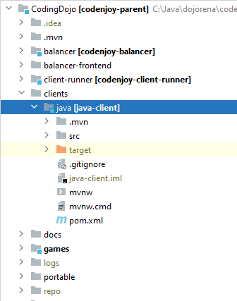

Его структура такая:

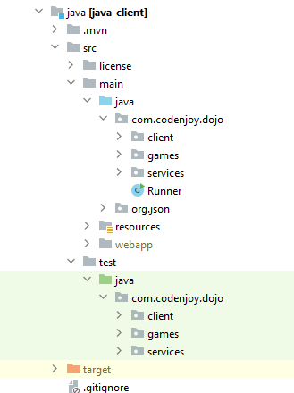

- client - пакет содержит все что касается клиентского кода.
- services - содержит все, что пришлось забрать из Engine сюда, потому как client зависит от этого стафа.
- games - внутри купа игрушек по пакетам побиты.

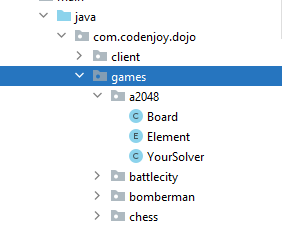

В каждой чаще всего встречаются
- Board - с методами-дополнениями для борды;
- Element (который теперь тут сторится, раньше числился в игрушке как Elements);
- и YourSolver для написания кода играющего (реализовать с 1 солвером для всех игр не получилось).

Так же в тестах для каждой игрушки:
- заготовка под тест для солвера;
- и тест для борды.

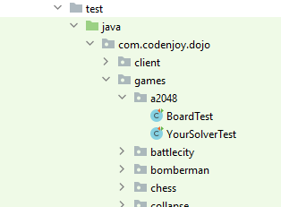

Иногда для некоторых игрушек, структура чуть меняется.

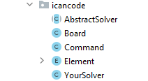

Но суть остается та же. Тут три роли: борда, элементс мапа и солвер игрока
в корне я оставил mvnw навсякий, может надо будет билдить игроку.

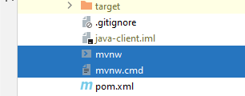

Чтобы участник не ставил maven на свою машину.

Если зайти в pom.xml то там есть два момента.

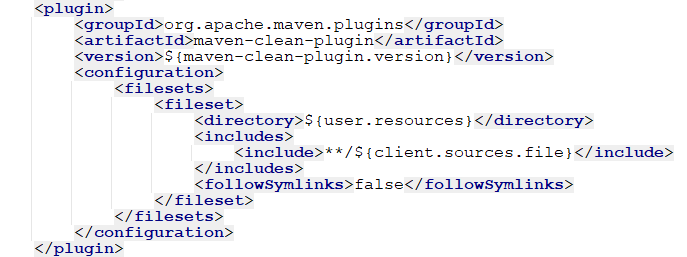

Так мы подчистим файл с сырцами.

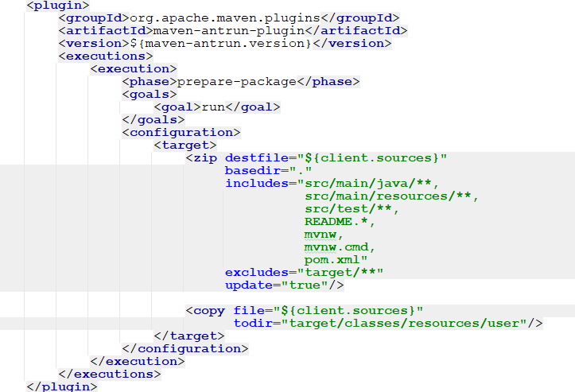

А так мы его создаем во время сборки.

Вот константы как определены.

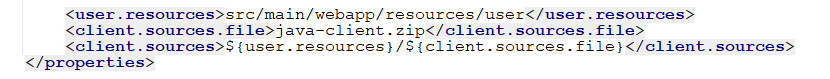

Zip файл расположится в инсталируемом в .m2 папку jar этого проекта (при mvn clean install), ляжет zip в папке /resources/user/java-client.zip, а внутри будут все сырцы этого проекта

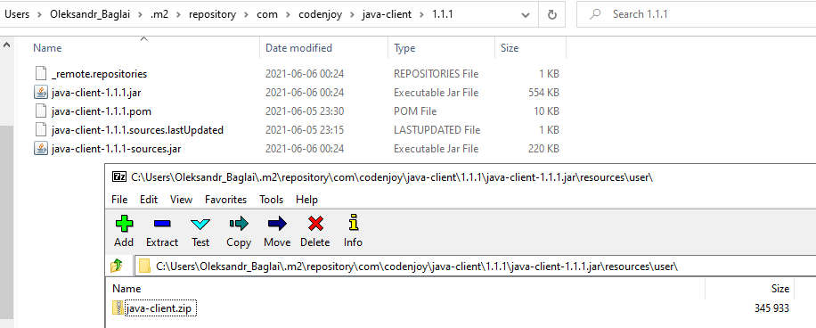

Внутри сырцы java client.

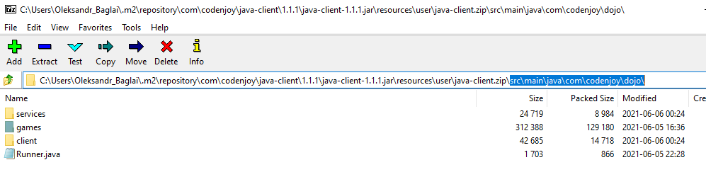

Эти файлы на момент написания мануала находятся в папке files этого мануала.

Дальше немного Моагии.

Каждая игрушка сама должна позаботиться о своих клиентах и созрать zip с ними. Раньше это делалось во время билда jar игры подобным образом ant'ом внутри maven'а из сырцов.

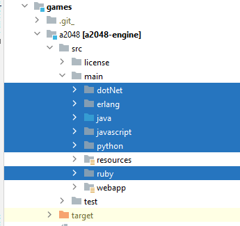

Все остается (пока не мигрируем все клиенты) как и раньше с одним лишь исключением - теперь java сырцы находятся в /resources/user/java-client.zip стороннего с точки зрения игры jar

А потому будем колдовать.

В games/pom.xml есть плагин.

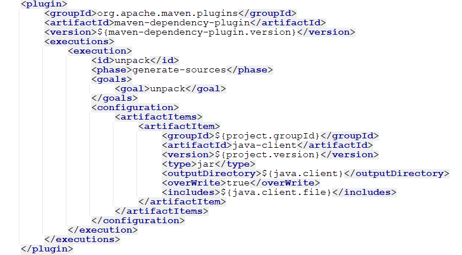

Он распакует из java-client.jar дипенденси (которая явно в плагине указана) тот /resources/user/java-client.zip в папочку target/java-client.

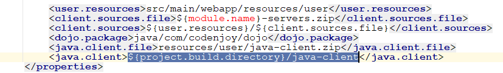

А после на другой фазе отработает ant.

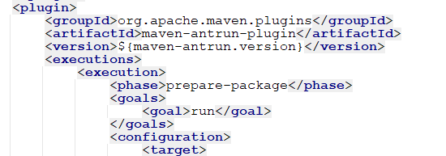

Вначале он распакуте zip в той же папке, чтобы добраться до сырцов java-client.

Потом скопирует в <game>-servers.zip (тот что уже сервер отдавать будет) только те сырцы, что нужны (пакеты services, client, games/<game> со всем что надо для запуска проекта) - это java часть. Другие игры не включатся, только games/<game>.

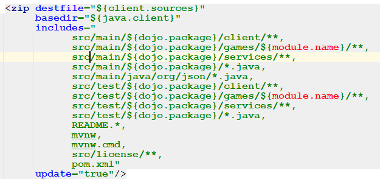

Следом отработает копировальщик сырцов других языков из сырцов игрового проекта.

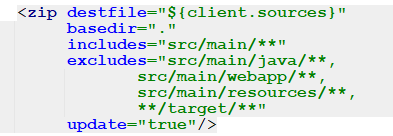

Вот этих (все кроме java).

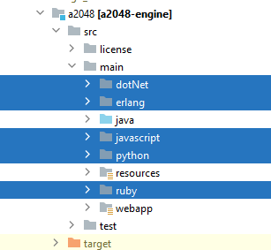

Дальше скопируется в zip logback.xml пустой для отключени вывода треша дебагового в клиенте (это старая штука).

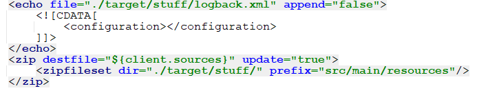

И наконец перепакованный <game>-servers.zip ляжет в нужное ему место. 

Тут его будет искать codenjoy server когда будет запрос этого зипа как ресурса. Сервер ищет во всех jar дипенденсях с помощью этого малого.

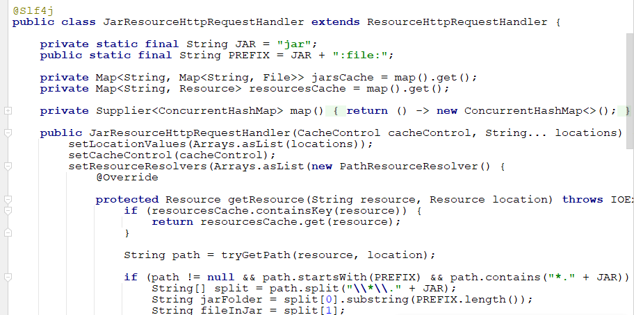

Это временное решение, пока не перенесем все клиенты каждый в свой репо. Тогда можно будет переписать скрин отдачи клиентов и захардкодить там ссылки на github по каждому языку. А весь этот код выпилить нафиг, вздохнув с облегчением ).

